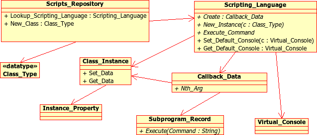

.. _Embedding_script_languages:

***************************************
**Scripts**: Embedding script languages
***************************************

In a lot of contexts, you want to give the possibility to users to extend
your application. This can be done in several ways: define an Ada API from
which they can build dynamically loadable modules, provide the whole source
code to your application and let users recompile it, interface with a simpler
scripting languages,...

Dynamically loadable modules can be loaded on demand, as their name indicate.
However, they generally require a relatively complex environment to build,
and are somewhat less portable. But when your users are familiar with Ada,
they provide a programming environment in which they are comfortable.
As usual, changing the module requires recompilation, re-installation,...

Providing the source code to your application is generally even more
complex for users. This requires an even more complex setup, your application
is generally too big for users to dive into, and modifications done by one
users are hard to provide to other users, or will be lost when you
distribute a new version of your application.

The third solution is to embed one or more scripting languages in your
application, and export some functions to it. This often requires your users
to learn a new language, but these languages are generally relatively simple,
and since they are interpreted they are easier to learn in an interactive
console. The resulting scripts can easily be redistributed to other users or
even distributed with future versions of your application.

The module in GNATColl helps you implement the third solution. It was
used extensively in the GPS programming environment for its python interface.

|Tip| Each of the scripting language is optional

This module can be compiled with any of these languages as an optional
dependency (except for the shell language, which is always built-in, but is
extremely minimal, and doesn't have to be loaded at run time anyway).
If the necessary libraries are found on the system, GNATColl will
be build with support for the corresponding language, but your application
can chose at run time whether or not to activate the support for a specific
language.

|Tip| Optional support is provided for the *gtk+* library.

Likewise, extensions are provided if the gtk+ libraries were found on your
system. These provide a number of Ada subprograms that help interface with
code using this library, and help export the corresponding classes.
This support for gtk+ is also optional, and you can still build
GNATColl even if gtk+ wasn't installed on your system (or if your
application is text-only, in which case you likely do not want to depend
at link time on graphical libraries).

.. index:: test driver
.. index:: testing your application

|Tip| Use a scripting language to provide an automatic testing framework for
your application.

The GPS environment uses python command for its *automatic test suite*,
including graphical tests such as pressing on a button, selecting a
menu,...

.. _Supported_languages:

Supported languages
===================

The module provides built-in support for several scripting languages, and
other languages can "easily" be added. Your application does not change
when new languages are added, since the interface to export subprograms
and classes to the scripting languages is language-neutral, and will
automatically export to all known scripting languages.

Support is provided for the following languages:

*Shell*
  This is a very simple-minded scripting language, which doesn't provide
  flow-control instructions (:ref:`The_Shell_language`).

*Python*
  Python (`http://www.python.org <http://www.python.org>`_) is an advanced scripting language
  that comes with an extensive library. It is fully object-oriented
  (:ref:`The_Python_language`).

.. _The_Shell_language:

The Shell language
------------------

The shell language was initially developed in the context of the GPS
programming environment, as a way to embed scripting commands in XML
configuration files.

In this language, you can execute any of the commands exported by the
application, passing any number of arguments they need. Arguments to function
calls can, but need not, be quoted. Quoting is only mandatory when they
contain spaces, newline characters, or double-quotes ('"'). To quote an
argument, surround it by double-quotes, and precede each double-quote it
contains by a backslash character. Another way of quoting is similar to
what python provides, which is to triple-quote the argument, i.e. surround it
by '"""' on each side. In such a case, any special character (in particular
other double-quotes or backslashes) lose their special meaning and are just
taken as part of the argument. This is in particular useful when you do not
know in advance the contents of the argument you are quoting::

  Shell> function_name arg1 "arg 2" """arg 3"""
  
Commands are executed as if on a stack machine: the result of a command is
pushed on the stack, and later commands can reference it using `%`
following by a number. By default, the number of previous results that are
kept is set to 9, and this can only be changed by modifying the source code
for GNATColl. The return values are also modified by commands executed
internally by your application, and that might have no visible output from
the user's point of view. As a result, you should never assume you know
what `%1`,... contain unless you just executed a command in the
same script::

  Shell> function_name arg1
  Shell> function2_name %1

In particular, the `%1` syntax is used when emulating object-oriented
programming in the shell. A method of a class is just a particular function
that contains a '.' in its name, and whose first implicit argument is the
instance on which it applies. This instance is generally the result of
calling a constructor in an earlier call. Assuming, for instance, that we
have exported a class "Base" to the shell from our Ada core, we could use
the following code::

  Shell> Base arg1 arg2
  Shell> Base.method %1 arg1 arg2
  
to create an instance and call one of its methods.
Of course, the shell is not the best language for object-oriented programming,
and better languages should be used instead.

When an instance has associated properties (which you can export from Ada
using `Set_Property`), you access the properties by prefixing its name
with "@"::
  
  Shell> Base arg1 arg2   # Build new instance
  Shell> @id %1           # Access its "id" field
  Shell> @id %1 5         # Set its "id" field
  

Some commands are automatically added to the shell when this scripting
language is added to the application. These are

.. index:: Function load

`Function load (file)`
  Loads the content of `file` from the disk, and execute each of its lines as
  a Shell command. This can for instance be used to load scripts when your
  application is loaded

.. index:: Function echo

`Function echo (arg...)`
  This function takes any number of argument, and prints them in the console
  associated with the language. By default, when in an interactive console, the
  output of commands is automatically printed to the console. But when you
  execute a script through `load` above, you need to explicitly call
  `echo` to make some output visible.

.. index:: Function clear_cache

`Function clear_cache`
  This frees the memory used to store the output of previous commands. Calling
  `%1` afterward will not make sense until further commands are executed.

.. _The_Python_language:

The Python language
-------------------

.. highlight:: python
.. index:: Python

Python is an interpreted, object-oriented language. See
`http://www.python.org <http://www.python.org>`_ for more information, including tutorials, on
this language.

|Note| Python support is optional in GNATColl. If it hasn't been installed
on your system, GNATColl will be compiled without it, but that
will not impact applications using GNATColl, since the same packages
(and the same API therein) are provided in both cases. Of course, if python
support wasn't compiled in, these packages will do nothing.

.. index:: GNATCOLL.Python
.. index:: gnatcoll-python.ads

In addition to the API common to all languages (:ref:`Scripts_API`),
GNATColl also comes with a low-level interface to the python
library. This interface is available in the :file:`GNATCOLL.Python` package.
In general, it is much simpler to use the common API rather than this
specialized one, though, since otherwise you will need to take care of lots
of details like memory management, conversion to and from python types,...

|Tip| All functions exported to python are available in a specific namespace

All functions exported to python through GNATColl are available in
a single python module, whose name you must specify when adding support
for python. This is done to avoid namespace pollution. You can further
organize the subprograms through python classes to provide more logical
namespaces.

As in Ada, python lets you use named parameters in subprogram calls,
and thus let's you change the order of arguments on the command line.
This is fully supported by GNATColl, although your callbacks will
need to specify the name of the parameters for this to work fine::

  >>> func_name (arg1, arg2)
  >>> func_name (arg2=arg2, arg1=arg1)`

Some commands and types are always exported by GNATColl, since they
are needed by most application, or even internally by GNATColl
itself.

.. index::  Exception Unexpected_Exception

`Exception Unexpected_Exception`

.. index:: Exception Exception

`Exception Exception`

.. index:: Exception Missing_Arguments

`Exception Missing_Arguments`

.. index:: Exception Invalid_Argument

`Exception Invalid_Argument`
  A number of exceptions are added automatically, so that the internal
  state of your application is reflected in python. These are raised on
  unexpected uncaught Ada exceptions, when your callbacks return explicit
  errors, or when a function call is missing some arguments.

.. index:: Function exec_in_console

`Function exec_in_console command`
  This function can be used in your script when you need to modify the
  contents of the python interpreter itself.

  When you run a python script, all its commands (including the global
  variables) are within the context of the script. Therefore, you cannot
  affect variables which are used for instance in the rest of your
  application or in the python console. With this function, `command`
  will be executed as if it had been typed in the python console::

    exec_in_console ("sys.ps1 = 'foo'")
    	=> foo>  # Prompt was changed in the console

.. index:: pygtk

PyGtk is a python extension that provides an interface to the popular
gtk+ library. It gives access to a host of functions for writing graphical
interfaces from python. GNATColl interfaces nicely with this extension
if it is found.

|Note| PyGtk support is also optional. It will be activated in your application
if the four following conditions are met: Python was detected on your system,
PyGtk was also detected when GNATColl is built, PyGtk is detected
dynamically when your application is launched and your code is calling the
`Init_PyGtk_Support` function

When PyGtk is detected, you can add the following method to any of the
classes you export to python:

.. index:: AnyClass pywidget

`AnyClass pywidget`
  This function returns an instance of a PyGtk class corresponding to the
  graphical object represented by `AnyClass`. In general, it makes sense when
  `AnyClass` is bound, in your Ada code, to a GtkAda object. As a result, the
  same graphical element visible to the user on the screen is available from
  three different programming languages: C, Ada and Python. All three can
  manipulate it in the same way

.. _Classes_exported_to_all_languages:

Classes exported to all languages
---------------------------------

In addition to the functions exported by each specific scripting language,
as described above, GNATColl exports the following to all the
scripting languages. These are exported when your Ada code calls the
Ada procedure `GNATCOLL.Scripts.Register_Standard_Classes`, which should
done after you have loaded all the scripting languages.

.. index:: Class Console

`Class Console`
  `Console` is a name that you can chose yourself when you call the
  above Ada procedure. It will be assumed to be `Console` in the rest
  of this document.

  This class provides an interface to consoles. A console is an input/output
  area in your application (whether it is a text area in a graphical
  application, or simply standard text I/O in text mode). In particular,
  the python standard output streams `sys.stdin`, `sys.stdout`
  and `sys.stderr` are redirected to an instance of that class. If you
  want to see python's error messages or usual output in your application,
  you must register that class, and define a default console for your
  scripting language through calls to
  `GNATCOLL.Scripts.Set_Default_Console`.

  You can later add new methods to this class, which would be specific to your
  application. Or you can derive this class into a new class to achieve a
  similar goal.

.. index:: Console.write

`Console.write(text)`
  This method writes `text` to the console associated with the class
  instance. See the examples delivered with GNATColl for examples on
  how to create a graphical window and make it into a `Console`.

.. index:: Console.clear

`Console.clear()`
  Clears the contents of the console.

.. index:: Console.flush

`Console.flush()`
  Does nothing currently, but is needed for compatibility with python.
  Output through `Console` instances is not buffered anyway.

.. index:: Console.isatty

`Console.isatty(): Boolean`
  Whether the console is a pseudo-terminal. This is always wrong in the
  case of GNATColl.

.. index:: Console.read

`Console.read([size]): string`
  Reads at most `size` bytes from the console, and returns the resulting
  string.

.. index:: Console.readline

`Console.readline([size]): string`
  Reads at most `size` lines from the console, and returns them as a single
  string.

.. _Scripts_API:

Scripts API
===========

This section will give an overview of the API used in the scripts module.
The reference documentation for this API is in the source files themselves. In
particular, each :file:`.ads` file fully documents all its public API.

As described above, GNATColl contains several levels of API. In
particular, it provides a low-level interface to python, in the packages
`GNATCOLL.Python`. This interface is used by the rest of GNATColl,
but is likely too low-level to really be convenient in your applications,
since you need to take care of memory management and type conversions by
yourself.

Instead, GNATColl provides a language-neutral Ada API. Using this
API, it is transparent for your application whether you are talking to the
Shell, to python, or to another language integrated in GNATColl.
The code remains exactly the same, and new scripting languages can be added
in later releases of GNATColl without requiring a change in your
application. This flexibility is central to the design of GNATColl.

In exchange for that flexibility, however, there are language-specific
features that cannot be performed through the GNATColl API. At
present, this includes for instance exporting functions that return hash
tables. But GNATColl doesn't try to export the greatest set of
features common to all languages. On the contrary, it tries to fully
support all the languages, and provide reasonable fallback for languages
that do not support that feature. For instance, named parameters (which
are a part of the python language) are fully supported, although the
shell language doesn't support them. But that's an implementation detail
transparent to your own application.

Likewise, your application might decide to always load the python
scripting language. If GNATColl wasn't compiled with python support,
the corresponding Ada function still exists (and thus your code still
compiles), although of course it does nothing. But since the rest of the
code is independent of python, this is totally transparent for your
application.

|Tip| GNATColl comes with some examples, which you can use
as a reference when building your own application.
See the :file:`scripts/examples` directory.

Interfacing your application with the scripting module is a multistep
process:

* You *must* **initialize** GNATColl and decide which features
  to load
* You *can* create an **interactive console** for the various
  languages, so that users can perform experiments interactively. This
  is optional, and you could decide to keep the scripting language has a
  hidden implementation detail (or just for automatic testing purposes
  for instance)
* You *can* **export** some classes and methods.
  This is optional, but it doesn't really make sense to just embed a
  scripting language and export nothing to it. In such a case, you might
  as well spawn a separate executable.
* You *can* load **start up scripts** or plug-ins that users have
  written to extend your application.

.. _Initializing_the_scripting_module:

Initializing the scripting module
---------------------------------

GNATColl must be initialized properly in order to provide added
value to your application. This cannot be done automatically simply by
depending on the library, since this initialization requires multiple-step
that must be done at specific moments in the initialization of your whole
application.

This initialization does not depend on whether you have build support
for python or for gtk+ in GNATColl. The same packages and subprograms
are available in all cases, and therefore you do not need conditional
compilation in your application to support the various cases.

.. _Create_the_scripts_repository:

Create the scripts repository
^^^^^^^^^^^^^^^^^^^^^^^^^^^^^

The type `GNATCOLL.Scripts.Scripts_Repository` will contain various
variables common to all the scripting languages, as well as a list of the
languages that were activated. This is the starting point for all other
types, since from there you have access to everything. You will have only
one variable of this type in your application, but it should generally be
available from all the code that interfaces with the scripting language.

Like the rest of GNATColl, this is a tagged type, which you can
extend in your own code. For instance, the GPS programming environment is
organized as a kernel and several optional modules. The kernel provides
the core functionality of GPS, and should be available from most functions
that interface with the scripting languages. Since these functions have
very specific profiles, we cannot pass additional arguments to them. One
way to work around this limitation is to store the additional arguments
(in this case a pointer to the kernel) in a class derived from
`Scripts_Repository_Data`.

.. highlight:: ada

As a result, the code would look like::

  with GNATCOLL.Scripts;
  Repo : Scripts_Repository := new Scripts_Repository_Record;

or, in the more complex case of GPS described above::

  type Kernel_Scripts_Repository is new
     Scripts_Repository_Data with record
        Kernel : ...;
  end record;
  Repo : Scripts_Repository := new Kernel_Scripts_Repository'
     (Scripts_Repository_Data with Kernel => ...);

.. _Loading_the_scripting_language:

Loading the scripting language
^^^^^^^^^^^^^^^^^^^^^^^^^^^^^^

The next step is to decide which scripting languages should be made
available to users. This must be done before any function is exported,
since only functions exported after a language has been loaded will be
made available in that language.

|Note| If for instance python support was build into GNATColl, and
if you decide not to make it available to users, your application will
still be linked with :file:`libpython`. It is therefore recommended although
not mandatory to only build those languages that you will use.

This is done through a simple call to one or more subprograms. The following
example registers both the shell and python languages::

  with GNATCOLL.Scripts.Python;
  with GNATCOLL.Scripts.Shell;
  Register_Shell_Scripting (Repo);
  Register_Python_Scripting (Repo, "MyModule");

.. index:: Procedure Register_Shell_Scripting

`Procedure Register_Shell_Scripting (Repo)`
  This adds support for the shell language. Any class or function that is
  now exported through GNATColl will be made available in the shell

.. index:: Procedure Register_Python_Scripting

`Procedure Register_Python_Scripting (Repo, Module_Name)`
  This adds support for the python language. Any class or function exported
  from now on will be made available in python, in the module specified
  by `Module_Name`

.. _Exporting_standard_classes:

Exporting standard classes
^^^^^^^^^^^^^^^^^^^^^^^^^^

To be fully functional, GNATColl requires some predefined classes
to be exported to all languages (:ref:`Classes_exported_to_all_languages`).
For instance, the `Console` class is needed for proper interactive with
the consoles associated with each language.

These classes are created with the following code::

  Register_Standard_Classes (Repo, "Console");

This must be done only after all the scripting languages were loaded in the
previous step, since otherwise the new classes would not be visible in the
other languages.

.. index:: Procedure Register_Standard_Classes

`Procedure Register_Standard_Classes(Repo,Console_Class)`
  The second parameter `Console_Class` is the name of the class that
  is bound to a console, and thus provides input/output support. You can chose
  this name so that it matches the classes you intend to export later on from
  your application.

.. _Creating_interactive_consoles:

Creating interactive consoles
-----------------------------

The goal of the scripting module in GNATColl is to work both in
text-only applications and graphical applications that use the gtk+ toolkit.
However, in both cases applications will need a way to capture the output
of scripting languages and display them to the user (at least for errors, to
help debugging scripts), and possibly emulate input when a script is waiting
for such input.

GNATColl solved this problem by using an abstract class
`GNATCOLL.Scripts.Virtual_Console_Record` that defines an API for these
consoles. This API is used throughout `GNATCOLL.Scripts` whenever input or
output has to be performed.

|Tip| The :file:`examples/` directory in the GNATColl package
shows how to implement a console in text mode and in graphical mode.

If you want to provide feedback or interact with users, you will need to
provide an actual implementation for these `Virtual_Console`, specific
to your application. This could be a graphical text window, or based on
`Ada.Text_IO`. The full API is fully documented in
:file:`gnatcoll-scripts.ads`, but here is a list of the main subprograms that
need to be overriden.

.. index:: Virtual_Console.Insert_Text

`Virtual_Console.Insert_Text (Txt)`

.. index:: Virtual_Console.Insert_Log

`Virtual_Console.Insert_Log (Txt)`

.. index:: Virtual_Console.Insert_Error

`Virtual_Console.Insert_Error (Txt)`
  These are the various methods for doing output. Error messages could for
  instance be printed in a different color. Log messages should in general
  be directed elsewhere, and not be made visible to users unless in special
  debugging modes.

.. index:: Virtual_Console.Insert_Prompt

`Virtual_Console.Insert_Prompt (Txt)`
  This method must display a prompt so that the user knows input is expected.
  Graphical consoles will in general need to remember where the prompt ended
  so that they also know where the user input starts

.. index:: Virtual_Console.Set_As_Default_Console

`Virtual_Console.Set_As_Default_Console (Script)`
  This method is called when the console becomes the default console for
  a scripting language. They should in general keep a pointer on that
  language, so that when the user presses :kbd:`enter` they know which language
  must execute the command

.. index:: Virtual_Console.Read 

`Virtual_Console.Read (Size, Whole_Line) : String`
  Read either several characters or whole lines from the console. This is
  called when the user scripts read from their stdin.

.. index:: Virtual_Console.Set_Data_Primitive

`Virtual_Console.Set_Data_Primitive (Instance)`

.. index:: Virtual_Console.Get_Instance

`Virtual_Console.Get_Instance : Console`
  These two methods are responsible for storing an instance of `Console`
  into a `GNATCOLL.Scripts.Class_Instance`. Such an instance is
  what the user
  manipulates from his scripting language. But when he executes a method, the
  Ada callback must know how to get the associated `Virtual_Console`
  back to perform actual operations on it.

  These methods are implemented using one of the `GNATCOLL.Scripts.Set_Data`
  and `GNATCOLL.Scripts.Get_Data` operations when in text mode, or possibly
  `GNATCOLL.Scripts.Gtkada.Set_Data` and
  `GNATCOLL.Scripts.Gtkada.Get_Data`
  when manipulating graphical GtkAda objects.

There are lots of small details to take into account when writing a
graphical console. The example in :file:`examples/gtkconsole.ads`
should provide a good starting point. However, it doesn't handle things
like history of commands, preventing the user from moving the cursor
to previous lines,... which are all small details that need to be right
for the user to feel comfortable with the console.

.. highlight:: ada

Once you have created one or more of these console, you can set them as
the default console for each of the scripting languages. This way, any
input/output done by scripts in this language will interact with that
console, instead of being discarded. This is done through code similar
to::

  Console := GtkConsole.Create (...);
  Set_Default_Console
    (Lookup_Scripting_Language (Repo, "python"),
     Virtual_Console (Console));

Creating a new instance of `Console`, although allowed, will by
default create an unusable console. Indeed, depending on your application,
you might want to create a new window, reuse an existing one, or do many
other things when the user does::

  c = Console()

As a result, GNATColl does not try to guess the correct behavior,
and thus does not export a constructor for the console. So in the above
python code, the default python constructor is used. But this constructor
does not associate `c` with any actual `Virtual_Console`, and
thus any call to a method of `c` will result in an error.

To make it possible for users to create their own consoles, you need to
export a `Constructor_Method` (see below) for the `Console`
class. In addition to your own processing, this constructor needs also to
call::
  
     declare
        Inst : constant Class_Instance := Nth_Arg (Data, 1);
     begin
        C := new My_Console_Record;  --  or your own type
        GNATCOLL.Scripts.Set_Data (Inst, C);
     end

.. _Exporting_classes_and_methods:

Exporting classes and methods
-----------------------------

Once all scripting languages have been loaded, you can start exporting
new classes and functions to all the scripting languages. It is important
to realize that through a single Ada call, they are exported to all loaded
scripting languages, without further work required on your part.

.. _Classes_diagram:

Classes diagram
^^^^^^^^^^^^^^^

The following diagram shows the dependencies between the major data types
defined in :file:`GNATCOLL.Scripts`. Most of these are abstract classes that
are implemented by the various scripting languages. Here is a brief description
of the role of each type:

.. index:: class diagram, script module

.. index:: Class Scripts_Repository

`Class Scripts_Repository`
  As we have seen before, this is a type of which there is a single instance
  in your whole application, and whose main role is to give access to each
  of the scripting languages (`Lookup_Scripting_Language` function), and
  to make it possible to register each exported function only once (it then
  takes care of exporting it to each scripting language).

.. index:: Class Scripting_Language

`Class Scripting_Language`
  Instances of this type represent a specific language. It provides various
  operations to export subprograms, execute commands, create the other types
  described below,... There should exists a single instance of this class per
  supported language.

  This class interacts with the script interpreter (for instance python), and
  all code executed in python goes through this type, which then executes your
  Ada callbacks to perform the actual operation.

  It is also associated with a default console, as described above, so that
  all input and output of the scripts can be made visible to the user.

.. index:: Class Callback_Data

`Class Callback_Data`
  This type is an opaque tagged type that provides a language-independent
  interface to the scripting language. It gives for instance access to the
  various parameters passed to your subprogram (`Nth_Arg` functions),
  allows you to set the return value (`Set_Return_Value` procedure),
  or raise exceptions (`Set_Error_Msg` procedure),...

.. index:: Record Class_Type

`Record Class_Type`
  This type is not tagged, and cannot be extended. It basically represents a
  class in any of the scripting languages, and is used to create new instances
  of that class from Ada.

.. index:: Class Class_Instance

`Class Class_Instance`
  A class instance represents a specific instance of a class. In general,
  such an instance is strongly bound to an instance of an Ada type. For
  instance, if you have a `Foo` type in your application that you wish
  to export, you would create a `Class_Type` called "Foo", and then the
  user can create as many instances as he wants of that class, each of which
  is associated with different values of `Foo` in Ada.

  Another more specific example is the predefined `Console` class. As
  we have seen before, this is a `Virtual_Console` in Ada. You could
  for instance have two graphical windows in your application, each of which
  is a `Virtual_Console`. In the scripting language, this is exported
  as a class named `Console`. The user can create two
  instances of those, each of which is associated with one of your graphical
  windows. This way, executing `Console.write` on these instances would
  print the string on their respective graphical window.

  .. highlight:: python

  Some scripting languages, in particular python, allow you to store any
  data within the class instances. In the example above, the user could for
  instance store the time stamp of the last output in each of the instances.
  It is therefore important that, as much as possible, you always return the
  same `Class_Instance` for a given Ada object. See the following
  python example::

    myconsole = Console ("title") # Create new console
    myconsole.mydata = "20060619"  # Any data, really
    myconsole = Console ("title2")  # Create another window
    myconsole = Console ("title") # Must be same as first, 
    print myconsole.mydata  # so that this prints "20060619"

.. index:: Class Instance_Property

`Class Instance_Property`
  As we have seen above, a `Class_Instance` is associated in general with
  an Ada object. This `Instance_Property` tagged type should be extended
  for each Ada type you want to be able to store in a `Class_Instance`.
  You can then use the `Set_Data` and `Get_Data` methods of the
  `Class_Instance` to get and retrieve that associated Ada object.

.. index:: Class Subprogram_Record

`Class Subprogram_Record`
  This class represents a callback in the scripting language, that is some
  code that can be executed when some conditions are met.

  The exact semantic here depends on each of the programming languages. For
  instance, if you are programming in python, this is the name of a python
  method to execute. If you are programming in shell, this is any shell code.

  .. highlight:: python

  The idea here is to blend in as smoothly as possible with the usual constructs
  of each language. For instance, in python one would prefer to write the
  second line rather than the third::

    def on_exit():
       pass
    set_on_exit_callback(on_exit)   # Yes, python style
    set_on_exit_callback("on_exit") # No

  The last line (using a string as a parameter) would be extremely unusual
  in python, and would for instance force you to qualify the subprogram name
  with the name of its namespace (there would be no implicit namespace
  resolution).

  To support this special type of parameters, the `Subprogram_Record`
  type was created in Ada.

Although the exact way they are all these types are created is largely
irrelevant to your specific application in general, it might be useful for you
to override part of the types to provide more advanced features. For instance,
GPS redefines its own Shell language, that has basically the same behavior as
the Shell language described above but whose `Subprogram_Record` in fact
execute internal GPS actions rather than any shell code.

.. _Exporting_functions:

Exporting functions
^^^^^^^^^^^^^^^^^^^

.. highlight:: ada

All functions that you export to the scripting languages will result in a
call to an Ada subprogram from your own application. This subprogram must
have the following profile::

  procedure Handler
     (Data    : in out Callback_Data'Class;
      Command : String);

The first parameter `Data` gives you access to the parameters of the
subprogram as passed from the scripting language, and the second parameter
`Command` is the name of the command to execute. The idea behind this
second parameter is that a single Ada procedure might handle several
different script function (for instance because they require common actions
to be performed).

.. index:: Register_Command

`Register_Command (Repo,Command,Min_Args,Max_Args,Handler)`
  Each of the shell functions is then exported through a call to
  `Register_Command`. In its simplest form, this procedure takes the
  following arguments. `Repo` is the scripts repository, so that the
  command is exported to all the scripting languages. `Command` is the
  name of the command. `Min_Args` and `Max_Args` are the minimum and
  maximum number of arguments. Most language allow option parameters, and
  this is how you specify them. `Handler` is the Ada procedure to call
  to execute the command.

Here is a simple example. It implements a function called `Add`, which
takes two integers in parameter, and returns their sum::

  Arg1_C : aliased constant String := "arg1";
  Arg2_C : aliased constant String := "arg2";

  procedure Sum
     (Data : in out Callback_Data'Class;
      Command : String)
  is
     Arg1, Arg2 : Integer;
  begin
     Name_Parameters ((1 => Arg1_C'Access, 2 => Arg2_C'Access));
     Arg1 := Nth_Arg (Data, 1);
     Arg2 := Nth_Arg (Data, 2);
     Set_Return_Value (Data, Arg1 + Arg2);
  end Sum;

  Register_Command (Repo, "sum", 2, 2, Sum'Access);

This is not the most useful function to export! Still, it illustrates a
number of important concepts.

Automatic parameters types
~~~~~~~~~~~~~~~~~~~~~~~~~~

When the command is registered, the number of arguments is specified.
This means that GNATColl will check on its own whether the right
number of arguments is provided. But the type of these arguments is not
specified. Instead, your callback should proceed as if they were correct,
and try to retrieve them through one of the numerous `Nth_Arg`
functions. In the example above, we assume they are integer. But if one of
them was passed as a string, an exception would be raised and sent back to
the scripting language to display a proper error message to the user. You
have nothing special to do here.

Support for named parameters
~~~~~~~~~~~~~~~~~~~~~~~~~~~~

Some languages (especially python) support named parameters, ie parameters
can be specified in any order on the command line, as long as they are
properly identified (very similar to Ada's own capabilities). In the example
above, the call to `Name_Parameters` is really optional, but adds this
support for your own functions as well. You just have to specify the name
of the parameters, and GNATColl will then ensure that when you
call `Nth_Arg` the parameter number 1 is really "arg1".
For scripting languages that do not support named parameters, this has no
effect.

Your code can then perform as complex a code as needed, and finally
return a value (or not) to the scripting language, through a call to
`Set_Return_Value`.

.. highlight:: python

After the above code has been executed, your users can go to the python
console and type for instance::

  from MyModule import *    # MyModule is the name we declared above
  print sum (1,2)
  	=> 3
  print sum ()
  	=> Error:  Wrong number of parameters
  print sum ("1", 2)
  	=> Error:  Parameter 1 should be an integer
  print sum (arg2=2, arg1=1)
  	=> 3

.. _Exporting_classes:

Exporting classes
^^^^^^^^^^^^^^^^^

Whenever you want to make an Ada type accessible through the scripting
languages, you should export it as a class. For object-oriented languages,
this would map to the appropriate concept. For other languages, this provides
a namespace, so that each method of the class now takes an additional first
parameter which is the instance of the class, and the name of the method is
prefixed by the class name.

.. highlight:: ada

Creating a new class is done through a call to `New_Class`, as shown
in the example below::

  MyClass : Class_Type;
  MyClass := GNATCOLL.Scripts.New_Class (Repo, "MyClass");

At this stage, nothing is visible in the scripting language, but all the
required setup has been done internally so that you can now add methods to
this class.

You can then register the class methods in the same way that you registered
functions. An additional parameter `Class` exists for
`Register_Command`. A method is really just a standard function that
has an implicit first parameter which is a `Class_Instance`. This
extra parameter should not be taken into account in `Min_Args` and
`Max_Args`. You can also declare the method as a static method, ie
one that doesn't take this extra implicit parameter, and basically just
uses the class as a namespace.

Some special method names are available. In particular,
`Constructor_Method` should be used for the constructor of a class.
It is a method that receives, as its first argument, a class instance that
has just been created. It should associate that instance with the Ada
object it represents.

.. highlight:: python

Here is a simple example that exports a class. Each instance of this class
is associated with a string, passed in parameter to the constructor. The
class has a single method `print`, which prints its string parameter
prefixed by the instance's string. To start with, here is a python example
on what we want to achieve::

  c1 = MyClass ("prefix1")
  c1.print ("foo")
  	=> "prefix1 foo"
  c2 = MyClass ()  # Using a default prefix
  c2.print ("foo")
  	=> "default foo"

.. highlight:: ada

Here is the corresponding Ada code::

  with GNATCOLL.Scripts.Impl;
  procedure Handler
     (Data : **in out** Callback_Data'Class; Command : String)
  is
     Inst : Class_Instance := Nth_Arg (Data, 1, MyClass);
  begin
     if Command = Constructor_Method then
       Set_Data (Inst, MyClass, Nth_Arg (Data, 2, "default"));
     elsif Command = "print" then
       Insert_Text
          (Get_Script (Data), null,
           String'(Get_Data (Inst)) & " " & Nth_Arg (Data, 2));
     end if;
  end Handler;

  Register_Command
    (Repo, Constructor_Method, 0, 1, Handler'Access, MyClass);
  Register_Command
    (Repo, "print", 1, 1, Handler'Access, MyClass);

This example also demonstrates a few concepts: the constructor is declared
as a method that takes one optional argument. The default value is in
fact passed in the call to `Nth_Arg` and is set to "default".
In the handler, we know there is always a first argument which is the
instance on which the method applies. The implementation for the
constructor stores the prefix in the instance itself, so that several
instances can have different prefixes (we can't use global variables,
of course, since we don't know in advance how many instances will exist).
The implementation for `print` inserts code in the default console
for the script (we could of course use `Put_Line` or any other way
to output data), and computes the string to output by concatenating the
instance's prefix and the parameter to `print`.

Note that `Set_Data` and `Get_Data` take the class in parameter,
in addition to the class instance. This is needed for proper handling of
multiple inheritance: say we have a class `C` that extends two classes
`A` and `B`. The Ada code that deals with `A` associates an
integer with the class instance, whereas the code that deals with `B`
associates a string. Now, if you have an instance of `C` but call a
method inherited from `A`, and if `Get_Data` didn't specify the
class, there would be a risk that a string would be returned instead of the
expected integer. In fact, the proper solution here is that both `A`
and `B` store their preferred data at the same time in the instances,
but only fetch the one they actually need. Therefore instances of `C`
are associated with two datas.

Here is a more advanced example that shows how to export an Ada object. Let's
assume we have the following Ada type that we want to make available to
scripts::

  type MyType is record
     Field : Integer;
  end record;

As you can see, this is not a tagged type, but could certainly be. There is
of course no procedure `Set_Data` in :file:`GNATCOLL.Scripts` that enables
us to store `MyType` in a `Class_Instance`. This example shows how
to write such a procedure. The rest of the code would be similar to the
first example, with a constructor that calls `Set_Data`, and methods
that call `Get_Data`::

  type MyPropsR is new Instance_Property_Record with record
     Val : MyType;
  end record;
  type MyProps is access all MyPropsR'Class;

  procedure Set_Data
    (Inst : Class_Instance; Val : MyType)
  is
  begin
    Set_Data (Inst, Get_Name (MyClass), MyPropsR'(Val => Val));
  end Set_Data;

  function Get_Data (Inst : Class_Instance) return MyType is
     Data : MyProps := MyProps (Instance_Property'
        (Get_Data (Inst, Get_Name (MyClass))));
  begin
     return Data.Val;
  end Get_Data;

Several aspects worth noting in this example. Each data is associated with
a name, not a class as in the previous example. That's in fact the same
thing, and mostly for historical reasons. We have to create our own
instance of `Instance_Property_Record` to store the data, but the
implementation presents no special difficulty. In fact, we don't absolutely
need to create `Set_Data` and `Get_Data` and could do everything
inline in the method implementation, but it is cleaner this way and easier
to reuse.

GNATColl is fully responsible for managing the lifetime of the
data associated with the class instances and you can override the procedure
`Destroy` if you need special memory management.

.. _Reusing_class_instances:

Reusing class instances
^^^^^^^^^^^^^^^^^^^^^^^

We mentioned above that it is more convenient for users of your exported
classes if you always return the same class instance for the same Ada
object (for instance a graphical window should always be associated with
the same class instance), so that users can associate their own internal
data with them.

GNATColl provides a few types to facilitate this. In passing, it
is worth noting that in fact the Ada objects will be associated with a
single instance *per scripting language*, but each language has its
own instance. Data is not magically transferred from python to shell!

There are two cases to distinguish here:

* The Ada object derives from a GtkAda object

  In such a case, the package :file:`GNATCOLL.Scripts.GtkAda` provides three
  procedures that automatically associate the instance with the object,
  and can return the class instance associated with any given GtkAda
  object, or can return the GtkAda object stored in the instance. There is
  nothing else to do that to call `Set_Data` as we have seen above.
  See below for a brief discussion on the Factory design pattern. The internal
  handling is complex, since python
  for instance has ref-counted types, and so does gtk+. For the memory to
  be correctly freed when no longer needed, GNATColl must properly
  takes care of these reference counting. The result is that the class
  instance will never be destroyed while the gtk+ object exists, but the
  gtk+ object might be destroyed while the class instance still exists (in
  which case no further operation on that instance is possible).

* The Ada object does not derive from a GtkAda object

  In such a case, you should store the list of associated instances with
  your object. The type `GNATCOLL.Scripts.Instance_List_Access` is meant for
  that purpose, and provides two `Set` and `Get` primitives
  to retrieve existing instances.

  There is one catch however, related to memory management. The instances
  must continue to exist as long as the Ada object exist (and not be
  destroyed for instance when the python variables goes out of scope).
  GNATColl mostly takes care of that for you, but requires a little
  bit of help still: when you implement a new `Instance_Property_Record`
  as in the example above, you must also override its primitive
  `Get_Instances` to return the `Instance_List_Access`. That's it.

The final aspect to consider here is how to return existing instances.
This cannot be done from the constructor method, since when it is called
it has already received the created instance (this is forced by python, and
was done the same for other languages for compatibility reasons).
There are two ways to work around that limitation:

* Static `get` methods

  .. highlight:: python

  With each of your classes, you can export a static method generally called
  `get` that takes in parameter a way to identify an existing instance,
  and either return it or create a new one. It is also recommended to disable
  the constructor, ie force it to raise an error. Let's examine the python
  code as it would be used::

    ed = Editor ("file.adb")  # constructor
    	=> Error, cannot construct instances
    ed = Editor.get ("file.adb")
    	=> Create a new instance
    ed2 = Editor.get ("file.adb")
    	=> Return existing instance
    ed == ed2
    	=> True	
    
  .. highlight:: ada

  The corresponding Ada code would be something like::

    type MyType is record
       Val : Integer;
       Inst : Instance_List_Access;
    end record;
    type MyTypeAccess is access all MyType;
    procedure Handler
      (Data : in out Callback_Data'Class; Cmd : String)
    is
       Inst : Class_Instance;
       Tmp  : MyTypeAccess;
    begin
       if Cmd = Constructor_Method then
         Set_Error_Msg (Data, "cannot construct instances");
       elsif Cmd = "get" then
         Tmp := check_if_exists (Nth_Arg (Data, 1));
         if Tmp = null then
            Tmp := create_new_mytype (Nth_Arg (Data, 1));
            Tmp.Inst := new Instance_List;
         end if;
         Inst := Get (Tmp.Inst.all, Get_Script (Data));
         if Inst = null then
            Inst := New_Instance (Get_Script (Data), MyClass);
            Set (Tmp.Inst.all, Get_Script (Data), Inst);
            Set_Data (Inst, Tmp);
         end if;
         return Inst;
       end if;
    end Handler;

* Factory classes

  The standard way to do this in python, which applies to other languages
  as well, is to use the Factory design pattern. For this, we need to
  create one class (`MyClassImpl`) and one factory
  function (`MyClass`).

  .. highlight:: python

  The python code now looks like::

    ed = MyClass ("file.adb")  # Create new instance
    	=> ed is of type MyClassImpl
    ed = MyClass ("file.adb")  # return same instance
    ed.do_something()
    

  It is important to realize that in the call above, we are not calling
  the constructor of a class, but a function. At the Ada level, the function
  has basically the same implementation as the one we gave for `get`
  above. But the python code looks nicer because we do not have these
  additional `.get()` calls. The name of the class `MyClassImpl`
  doesn't appear anywhere in the python code, so this is mostly transparent.

  However, if you have more than one scripting language, in particular for
  the shell, the code looks less nice in this case::

    MyClass "file.adb"
    	=>  <MyClassImpl_Instance_0x12345>
    MyClassImpl.do_something %1
    
  and the new name of the class is visible in the method call.

.. _Executing_startup_scripts:

Executing startup scripts
-------------------------

The final step in starting up your application is to load extensions or
plug-ins written in one of the scripting languages.

There is not much to be said here, except that you should use the
`GNATCOLL.Scripts.Execute_File` procedure to do so.

.. _Debugging_scripts:

Debugging scripts
-----------------

GNATColl provides a convenient hook to debug your script. By default,
a script (python for instance) will call your Ada callback, which might
raise errors. Most of the time, the error should indeed be reported to the
user, and you can thus raise a standard exception, or call
`Set_Error_Msg`.

But if you wish to know which script was executing the command, it is
generally not doable. You can however activate a trace
(:ref:`Logging_information`) called `"PYTHON.TB"` (for "traceback"), which will
output the name of the command that is being executed, as well as the
full traceback within the python scripts. This will help you locate which
script is raising an exception.

